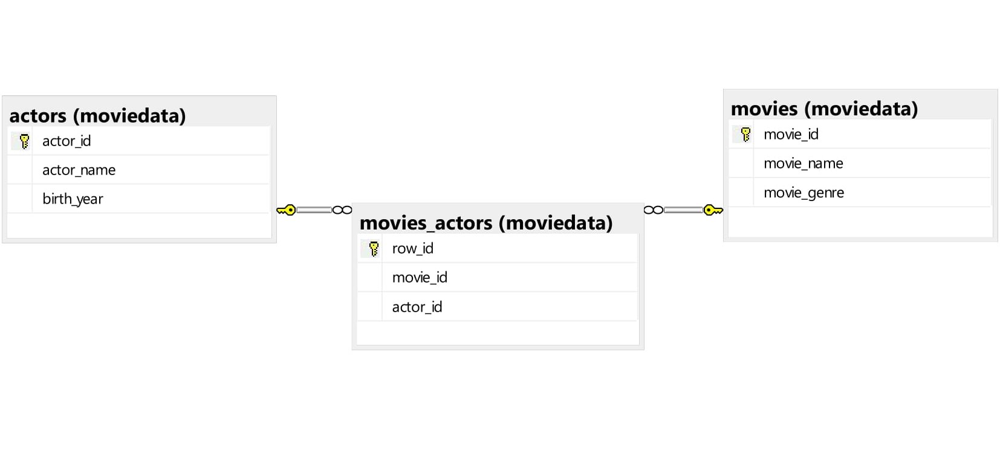

# 🍿Movie-Dataset 

A demonstration for:
* creating a schema 
* creating tables
* insert data
* how to make many-to-many relationship
* how to make queries.

$$
{\Huge \color{red}{\textbf{Tables}} \space \color{orange}{\textbf{Diagram}}
$$

  <!---->
  

